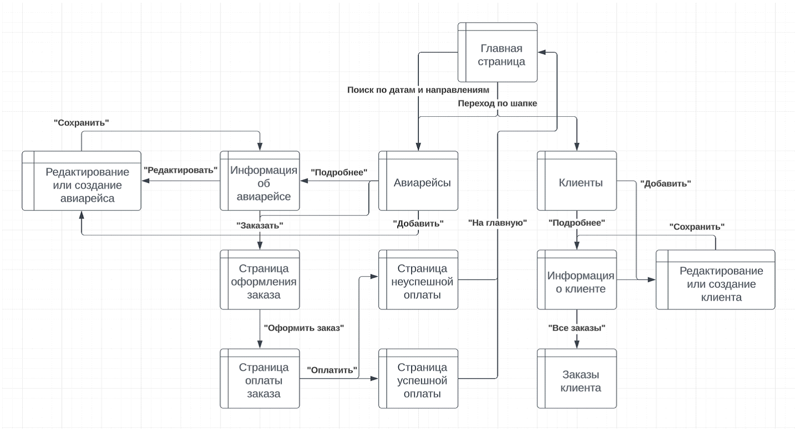
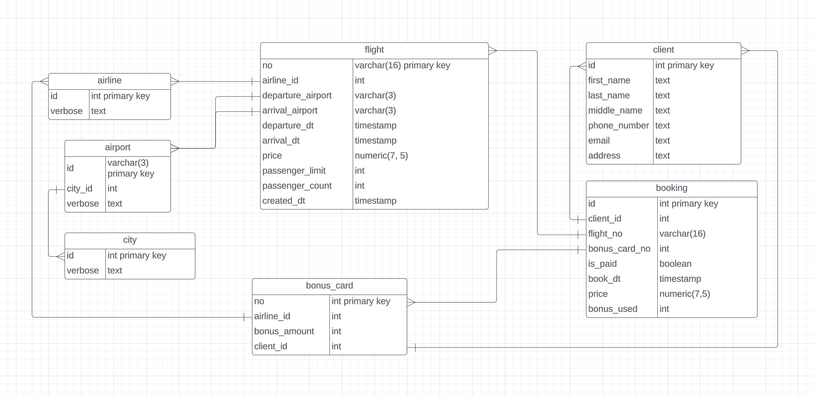
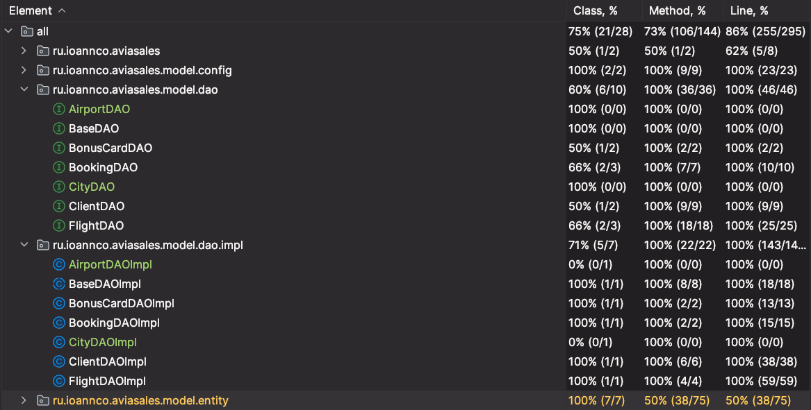

# Проект "Aviasales"
Черемисенов Иван, Web-Практикум, весна 2024 года.

## Описание страниц сайта

На всех страницах присутствует шапка со ссылками на основные страницы: Главная страница, Авиарейсы, Клиенты.

1. **Главная страница:**
    1. Приветствие и краткое описание сервиса.
    1. Поиск рейсов по дате и направлению.

1. **Страница списка авиарейсов:**
    1. Фильтры для выбора даты, направления и других параметров: возможность покупки, наличие свободных мест, авиакомпании, номер рейса и диапазон стоимости.
    1. Параметры сортировки по времени, стоимости и количеству свободных мест.
    1. Таблица с информацией о доступных рейсах с элементами навигации по страницам таблицы (номер страницы таблицы, кнопки «Далее» и «Назад»).
    1. В каждой строке таблицы указаны дата и время вылета и прилета, аэропорты и города вылета и прилета, время в полете и стоимость. Справа, рядом с информацией, находится кнопка для перехода на страницу с просмотром подробной информации о рейсе (“Подробнее”). Также, при наличии возможности покупки, будет кнопка «Заказать», направляющая на страницу заказа.
    1. Кнопка для добавления нового рейса.

1. **Страница информации о рейсе:**
    1. Подробная информация о выбранном рейсе, включая компанию, номер рейса, аэропорты вылета и прилета, время вылета и прилета, стоимость билетов и количество доступных мест.
    1. Кнопка «Заказать» для перехода на страницу заказа, при наличие такой возможности, или информация о том, что покупка билетов на данный рейс закрыта.
    1. Кнопка «Редактировать» для перехода на страницу редактирования рейса.
    1. Кнопка «Удалить» для удаления рейса.

1. **Страница заказа билета:**
    1. Краткая информация о рейсе, в том числе стоимость.
    1. Форма для ввода данных о клиенте, на которого производится покупка (ФИО и email)
    1. Кнопка «Оформить заказ»

1. **Страница оплаты заказа:**
    1. Краткая информация о заказе (данные о рейсе, данные о клиенте и номер заказа, стоимость).
    1. Форма для реквизитов, а также дополнительное поле с выпадающим списком карт клиента для использования бонусов.
    1. Кнопка «Оплатить»
    1. Кнопка «Отменить»

1. **Страница со списком клиентов:**
    1. Таблица со списком клиентов с возможностью фильтрации по номеру рейса и факту оплаты данного рейса.
    1. Поиск клиента по ФИО или контактной информации.
    1. В каждой строке таблицы кнопка «Подробнее» с переходом на страницу информации о клиенте
    1. Кнопка для перехода на страницу добавления нового клиента.

1. **Страница информации о клиенте:**
    1. Подробная информация о выбранном клиенте, включая ФИО, контактную информацию, историю последних заказов, бонусные карты и налетанные километры.
    1. Кнопка “Все заказы” для перехода на страницу с заказами клиента.
    1. Кнопка «Редактировать» для перехода на страницу редактирования клиента.
    1. Кнопка «Удалить» для удаления клиента.

1. **Страница заказов клиента:**
    1. Таблица с информацией о заказанных и оплаченных билетах клиента.
    1. Детальная информация о каждом заказе, включая дату заказа, рейс, цену, статус оплаты.
    1. Кнопки для перехода на страницу оплаты для заказов, которые не оплачены.

1. **Страница добавления/редактирования рейса:**
    1. Форма для ввода данных о новом рейсе или редактирования существующего.
    1. Поля для указания компании, номера рейса, аэропортов, времени вылета и прилета, стоимости билетов и количества мест.

1. **Страница добавления/редактирования клиента:**
    1. Форма для ввода данных о новом клиенте или редактирования существующего.
    1. Поля для указания ФИО, контактной информации и других данных о клиенте.
    1. Список из полей с данными бонусных карт, при их наличии, рядом с ними кнопки «Сохранить» и «Удалить».
    1. Поля для добавления новой бонусной карты и кнопка «Добавить».

1. **Страница успешной оплаты:**
    1. Уведомление об успешной оплате и данные заказа (номер заказа, номер рейса, и данные клиента)
1. **Страница неуспешной оплаты**
    1. Уведомление клиента о том, что оплата не прошла
## Сценарии использования
В каждом из сценариев предполагается, что пользователь находится на главной странице сайта.

- **Поиск, заказ и покупка авиабилетов по заданным направлениям и дате**
    - Ввести данные о направлениях (города или аэропорты), а также диапазон дат вылета и прилета.
    - Нажать на кнопку «Поиск», происходит переход на страницу «Авиарейсы».
    - При желании отсортировать билеты по нужным критериям (цене, времени прилета\вылета).
    - Выбрать билет и нажать на кнопку «Заказать», переход на страницу заказа.
    - Ввести ФИО и email клиента, нажать на кнопку «Оформить заказ».
    - Если клиент не найден, пользователь останется на странице оформления заказа с указанием неверных полей.
    - После успешного оформления заказа автоматически произойдет переход на страницу оплаты с указанием информации о заказе.
    - Ввести данные карты и, при наличии, выбрать бонусную карту, с которой будут списаны бонусы.
    - Если все данные верные, произойдет переход на страницу уведомления об успешной оплате, или неуспешной, если оплата не прошла.
    - Если данные неверные, будет указаны поля с неверными данными.

- **Просмотр информации об авиарейсах**
    - Перейти на страницу «Авиарейсы»
    - Отфильтровать по необходимым параметрам
    - Отсортировать по необходимым параметрам
    - Выбрать рейс, по которому необходимо просмотреть информацию, нажать на кнопку «Подробнее» для просмотра подробной информации.

- **Удаление авиарейса**
    - Перейти на страницу «Авиарейсы»
    - Отфильтровать по необходимым параметрам
    - Отсортировать по необходимым параметрам
    - Выбрать рейс, который необходимо удалить, нажать на кнопку «Подробнее»
    - Нажать на кнопку «Удалить»

- **Добавление авиарейса**
    - Перейти на страницу «Авиарейсы»
    - Нажать на кнопку «Добавить»
    - Ввести данные о рейсе
    - Нажать на кнопку «Сохранить»

- **Изменение информации об авиарейсе**
    - Перейти на страницу «Авиарейсы»
    - Отфильтровать авиарейсы по параметрам или найти авиарейс по номеру.
    - Перейти на страницу информации о рейсе по кнопке «Подробнее»
    - Перейти на страницу редактирования по кнопке «Редактировать»
    - Отредактировать данные в необходимых полях и нажать на кнопку «Сохранить»

- **Просмотр информации о клиенте**
    - Перейти на страницу «Клиенты»
    - Поиск клиента по заданным параметрам (ФИО, email или номер телефона)
    - Переход на страницу клиента по кнопке «Подробнее»

- **Добавление клиента**
    - Перейти на страницу «Клиенты»
    - Нажать на кнопку «Добавить»
    - Ввести информацию о клиенте
    - Нажать на кнопку «Сохранить»

- **Изменение информации о клиенте**
    - Перейти на страницу «Клиенты»
    - Найти клиента в поиске или по фильтрам
    - Перейти на страницу клиента по кнопке «Подробнее»
    - Перейти к форме редактирования по кнопке «Редактировать»
    - Изменить необходимые данные (при необходимости также добавить новую бонусную карту, или изменить текущую) и нажать на кнопку «Сохранить»

- **Удаление клиента**
    - Перейти на страницу «Клиенты»
    - Отфильтровать страницу при необходимости, или сразу произвести поиск по данным.
    - Перейти на страницу клиента по кнопке «Подробнее»
    - Нажать на кнопку «Удалить»

## Backend

Серверная часть сайта работает на фреймворке `Spring`. Взаимодействие с базой данных `PostgreSQL`
происходит с помощью движка `Hibernate`. Тестирование производится посредством `JUnit5` и `SpringBootTest`

В качестве сборщика используется инструмент `Gradle`

Для ускорения написания шаблонного кода используется библиотека времени компиляции `lombok`

### Схема базы данных

### Покрытие тестами

Для каждого из созданных интерфейсов доступа к базе данных был создан набор тестов, покрывающий 100% строк кода 
реализаций интерфейсов:

Непокрытые части кода являются геттерами и сеттерами, не содержащими существенной логики.